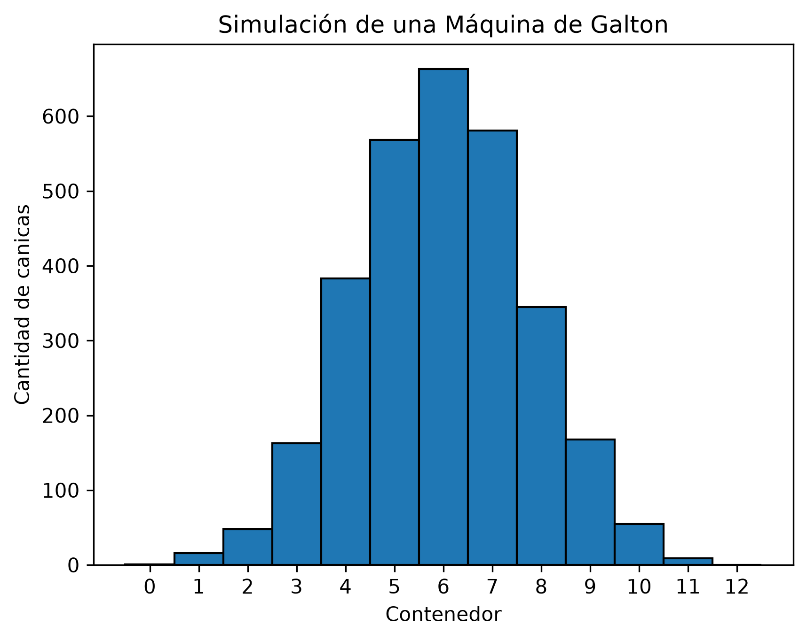

# Simulación de la Máquina de Galton

Proyecto del módulo 3 del curso **Fundamentos de Python** (bootcamp).
Autor: **Edwin Antonio Coca Navarro**

## ¿Qué hace el programa?

Simula una máquina de Galton con **3000 canicas** que caen por **12 niveles** de obstáculos.
En cada nivel, la canica elige al azar entre izquierda y derecha. Al final, el programa
muestra un **histograma** con la cantidad de canicas que cayó en cada contenedor.

Aunque en cada paso la probabilidad es 50 % y 50 %, la mayoría de las canicas cae en los
contenedores centrales y muy pocas en los extremos. Esto forma la conocida **campana**
de la distribución normal.



*(Cada ejecución da un resultado un poco distinto porque los números son aleatorios.)*

## ¿Cómo lo hice?

1. **Entendí el problema en papel.** Cada canica se parece a lanzar una moneda 12 veces.
   El contenedor donde cae es el número de veces que fue a la derecha (de 0 a 12, es decir,
   13 contenedores).
2. **Definí las constantes** `NUMERO_CANICAS = 3000` y `NUMERO_NIVELES = 12` para tener los
   datos del problema en un solo lugar.
3. **Creé la función `calcular_resultados`.** Por cada canica, repite 12 veces una decisión
   aleatoria con `random.randint(0, 1)`. Si sale 1 (derecha), suma 1 al contenedor. Al final
   guarda el contenedor de la canica en una lista.
4. **Creé la función `graficar_histograma`.** Usa `plt.hist` para contar las canicas por
   contenedor y agrega el título y los nombres de los ejes con `plt.title`, `plt.xlabel` y
   `plt.ylabel`.
5. **Probé cada parte por separado** (por ejemplo, comprobando que hubiera 3000 resultados
   y que los contenedores fueran de 0 a 12) antes de graficar.

### Conceptos de Python que usé

- Módulos: `random` y `matplotlib.pyplot`
- Funciones con parámetros y `return`
- Ciclos `for` anidados con `range`
- Condicionales `if`
- Listas y `append`
- Constantes

No usé la función `normal()`: la forma de campana aparece sola por la suma de decisiones
aleatorias.

## ¿Cómo ejecutarlo?

1. Instala matplotlib:

   ```
   pip install matplotlib
   ```

2. Ejecuta el programa:

   ```
   python EDWIN_COCA_proyectoM3.py
   ```

## Reflexiones del bootcamp

Lo que más me costó:
Lo que más me costó fue entender cómo representar las decisiones aleatorias de cada canica y cómo determinar en qué contenedor terminaba. Lo resolví dividiendo el problema en pasos pequeños y entendiendo primero cómo funcionaba una sola canica antes de simular las 3,000.

Lo que aprendí:
Aprendí a utilizar funciones con parámetros, ciclos for, condicionales, listas y números aleatorios. También aprendí a utilizar Matplotlib para representar los resultados mediante un histograma.

Lo que me gustó:
Me gustó poder ver gráficamente el resultado de la simulación y comprobar cómo muchas decisiones aleatorias pueden producir una distribución donde las canicas se concentran más hacia los contenedores centrales. Me pareció interesante porque pude relacionar la programación con un fenómeno matemático.

Cómo me ayuda en mi camino hacia tecnología:
Este proyecto me ayuda a fortalecer las bases de programación que necesito para continuar aprendiendo Inteligencia Artificial y análisis de datos. También me permite aprender a transformar un problema en pasos que pueden ser representados mediante código.

Lo que quiero aprender después:
Quiero seguir mejorando mis conocimientos de Python y aprender a trabajar con datos de una manera más profesional. Después quiero avanzar hacia análisis de datos, Machine Learning e Inteligencia Artificial para poder desarrollar mis propios proyectos

## 📊 Resultados de la simulación

